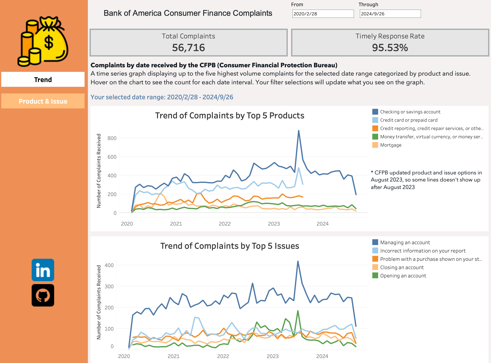

# Bank of America Consumer Complaints Analysis 

## 📚 Table of Contents

- [Project Workflow and Tool Used](#project-workflow-and-tool-used)
- [Project Background](#project-background)
- [Dataset Overview and Field Descriptions](#dataset-overview-and-field-descriptions)
- [Overview of Findings](#overview-of-findings)
- [Insights Deep Dive](#insights-deep-dive)

## Project Workflow and Tool Used

| #  | Purpose                | File Name with Link                                                                                             | Tools Used                    |
|----|------------------------|-----------------------------------------------------------------------------------------------------------------|-------------------------------|
| 1  | EDA                    | [EDA.ipynb](https://github.com/Rachel0619/US-Consumer-Finance-Complaints-Analysis/blob/main/EDA.ipynb)        | Python, Jupyter Notebook       |
| 2  | Data Cleaning & Wrangling | [transformation.ipynb](https://github.com/Rachel0619/US-Consumer-Finance-Complaints-Analysis/blob/main/transformation.ipynb) | Python, Jupyter Notebook       |
| 3  | Data Loading            | [data_loading_csv.py](https://github.com/Rachel0619/US-Consumer-Finance-Complaints-Analysis/blob/main/data_loading_csv.py) | Python, pgAdmin, Docker    |
| 4  | Data Analysis           | [analysis_sql_query.ipynb](https://github.com/Rachel0619/US-Consumer-Finance-Complaints-Analysis/blob/main/analysis_sql_query.ipynb) | Python, PostgreSQL       |
| 5  | Dashboard & Visualization| [Tableau Dashboard](https://public.tableau.com/app/profile/rachel.li3670/viz/consumerfinancecomplaints/Trend) | Tableau                        |


## Project Background 

This analysis focuses on consumer complaints filed against Bank of America (BOA), using data sourced from the Consumer Complaint Database provided by the Consumer Financial Protection Bureau (CFPB). The dataset contains information on a wide variety of consumer complaints related to financial products and services, including details such as the product, issue, state, and demographic tags. For this analysis, I filtered the dataset to focus exclusively on complaints related to Bank of America, rather than analyzing the entire database. The timeframe of this analysis covers complaints received between 2018-01-01 and 2024-09-25.

Insights and recommendations are provided on the following key areas:

- **Category 1: Product Analysis**
- **Category 2: Issue Analysis**
- **Category 3: Demographical Analysis** 
- **Category 4: Response Analysis** 

The objective of the analysis is to explore both the distribution and trends of complaints by product/sub-product, issue/sub-issue, and demographic group, providing insights into areas where Bank of America may need to improve customer service, operational efficiency, and product offerings. I wrote PostgreSQL queries to examine the proportion and distribution of complaints, identifying which products and issues are most common. Additionally, I created a Tableau dashboard to visualize the trends over time. 



## Dataset Overview and Field Descriptions

You will get a full picture of the database this project works on by examining this [field refernce](https://cfpb.github.io/api/ccdb/fields.html). 

This database contains a total of 17 fields (I dropped the "company" column because we are only working with Bank of America data here. I also dropped the "Consumer disputed?" here because all values for this field are missing):

- Text (Categorical and Descriptive): 12 fields, including fields like Product, Issue, Company public response, Consumer complaint narrative, and Tags. Many of these fields are categorical, while some like Consumer complaint narrative contain substantial text. 
- Date & Time: 2 fields, including Date received and Date sent to company. These fields allow for temporal analysis, such as identifying complaint trends over time.
- Numeric: 1 field, Complaint ID, which is a unique identifier for each complaint.
- Boolean: 2 fields, including Timely response?, Consumer consent provided?, which are binary in nature (yes/no). 

Given the heavy presence of text fields, especially the `Consumer complaint narrative`, this database lends itself well to NLP techniques to extract insights such as common themes, sentiment analysis, or complaint categorization. 

## Overview of Findings

The analysis reveals that checking and savings accounts are the most frequent source of complaints, with checking accounts alone accounting for a significant portion of consumer dissatisfaction. Issues around account management and fund transactions, particularly deposits and withdrawals, are also common themes in the complaints. On a demographic level, Washington, D.C. had the highest number of complaints per 1000 people in 2023, while Older Americans and Servicemembers represented key groups that require tailored attention to address their unique financial needs. These findings highlight several areas for improvement in Bank of America's products and services, with particular emphasis on customer service and operational efficiency in core banking functions.


## Insights Deep Dive
### Product Analysis:

- The "Checking or savings account" product category generated the highest number of complaints, representing 39.63% of the total. This indicates that core banking services are a significant source of dissatisfaction for Bank of America customers.

- Checking accounts specifically account for 84% of the complaints within this category. This suggests that operational and service-related issues in checking accounts—such as accessibility, fees, and transaction management—are key areas for improvement. Addressing these issues could significantly reduce the volume of complaints.

### Issue Analysis:

- The most common issue faced by Bank of America customers is "Managing an account", which accounts for 24.06% of all complaints. This highlights potential service gaps in areas such as account maintenance, customer support, and online banking functionality.

- A deeper look at sub-issues reveals that "Deposits and withdrawals" are a major pain point, representing 8.93% of all complaints. This suggests that Bank of America may need to focus on improving the efficiency and accuracy of handling customer funds, particularly in deposit and withdrawal transactions.

### Demographical Analysis:

- Washington, D.C. (DC) leads the ranking of complaints per 1000 people in 2023, showing a higher complaint rate when adjusted for population. This could indicate a region-specific issue or higher consumer awareness of financial protections in DC, warranting further investigation into the underlying causes of dissatisfaction in this area.

- Older Americans represent 7.43% of total complaints, while Servicemembers account for 5.52%. These two groups, though smaller in volume, likely face unique challenges, and tailored services or support mechanisms may be required to address their specific needs. Understanding and resolving their issues could help Bank of America better serve these important customer segments.

### Response Analysis

- Most Common Type of Response: The data shows that the majority of complaints were closed with an explanation, making up 65.46% of all responses. In contrast, only 24.25% of cases led to monetary relief, and an additional 8.39% resulted in non-monetary relief. This highlights that companies are more likely to provide an explanation rather than compensation.

- Most Common Sub-Issues for "Closed with Monetary Relief": Among the complaints that were resolved with monetary relief, the most common sub-issue was related to deposits and withdrawals (2.98%). Issues involving problem using a debit or ATM card (2.34%) and credit card disputes (1.86%) also appear frequently. This suggests that monetary relief is most often associated with problems that directly affect customers' access to or security of their funds. The high occurrence of disputes related to unauthorized transactions and fee problems shows the importance of proper transaction management and transparency in resolving consumer issues. The data also reflects that banking errors and problem during payment process are common pain points that are likely to lead to a financial settlement.


## 🛠️ Developer Guide

I used docker container to run postgres and pgadmin. To replicate the workflow, run the following steps:

Make sure your docker daemon is running before starting.

```
docker-compose build
docker-compose up -d
```

run `docker ps` to make sure that container for postgres and pgadmin are running, then navigate to 'localhost:8080' to open pgadmin GUI and login using the environment variable stored in `.env` file.

I used virtual envirnoment to run my analysis. To replicate the workflow, run the following commends:

```
conda env create -f environment.yml
conda activate complaints_analysis
```