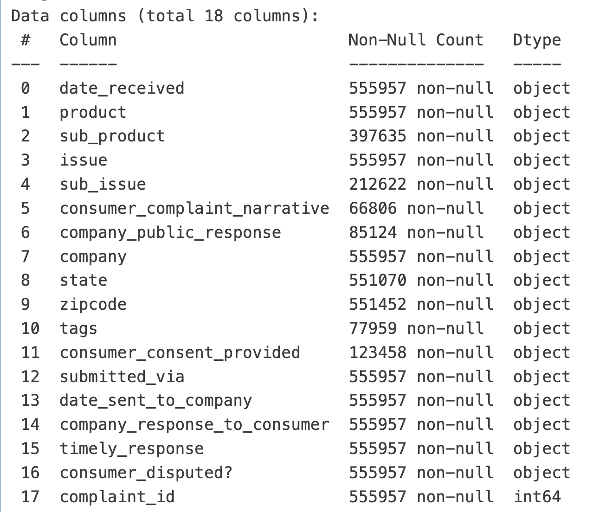

# US-Consumer-Finance-Complaints-Analysis

# Project Background
For the purposes of this project, the CFPB collected tons of consumers’ complaints with respect to financial products and services to companies. They would like to improve the financial marketplace based on those data and hope to use data analysis to advise their course of action.

According to the information derived from the given complaint base, more than 1/3 of the complaints is for Mortgage which is far more exceed the others. By analyzing which attribute are more likely to impact the result mentioned above, those related companies can then better target the key segment to tackle the problem of complaints.

Insights and recommendations are provided on the following key areas:

- **Category 1: Category Analysis**
- **Category 2: Company Analysis** 
- **Category 3: Demographical Analysis** 

The SQL queries used to inspect and clean the data for this analysis can be found here [link].

Targed SQL queries regarding various business questions can be found here [link].

An interactive Tableau dashboard used to report and explore sales trends can be found here [link].


# Data Structure & Initial Checks




# Executive Summary

### Overview of Findings

Explain the overarching findings, trends, and themes in 2-3 sentences here. This section should address the question: "If a stakeholder were to take away 3 main insights from your project, what are the most important things they should know?" You can put yourself in the shoes of a specific stakeholder - for example, a marketing manager or finance director - to think creatively about this section.

[Visualization, including a graph of overall trends or snapshot of a dashboard]


# Insights Deep Dive
### Category 1:

* **Main insight 1.** More detail about the supporting analysis about this insight, including time frames, quantitative values, and observations about trends.
  
* **Main insight 2.** More detail about the supporting analysis about this insight, including time frames, quantitative values, and observations about trends.
  
* **Main insight 3.** More detail about the supporting analysis about this insight, including time frames, quantitative values, and observations about trends.
  
* **Main insight 4.** More detail about the supporting analysis about this insight, including time frames, quantitative values, and observations about trends.

[Visualization specific to category 1]


### Category 2:

* **Main insight 1.** More detail about the supporting analysis about this insight, including time frames, quantitative values, and observations about trends.
  
* **Main insight 2.** More detail about the supporting analysis about this insight, including time frames, quantitative values, and observations about trends.
  
* **Main insight 3.** More detail about the supporting analysis about this insight, including time frames, quantitative values, and observations about trends.
  
* **Main insight 4.** More detail about the supporting analysis about this insight, including time frames, quantitative values, and observations about trends.

[Visualization specific to category 2]


### Category 3:

* **Main insight 1.** More detail about the supporting analysis about this insight, including time frames, quantitative values, and observations about trends.
  
* **Main insight 2.** More detail about the supporting analysis about this insight, including time frames, quantitative values, and observations about trends.
  
* **Main insight 3.** More detail about the supporting analysis about this insight, including time frames, quantitative values, and observations about trends.
  
* **Main insight 4.** More detail about the supporting analysis about this insight, including time frames, quantitative values, and observations about trends.

[Visualization specific to category 3]


### Category 4:

* **Main insight 1.** More detail about the supporting analysis about this insight, including time frames, quantitative values, and observations about trends.
  
* **Main insight 2.** More detail about the supporting analysis about this insight, including time frames, quantitative values, and observations about trends.
  
* **Main insight 3.** More detail about the supporting analysis about this insight, including time frames, quantitative values, and observations about trends.
  
* **Main insight 4.** More detail about the supporting analysis about this insight, including time frames, quantitative values, and observations about trends.

[Visualization specific to category 4]


# Recommendations:

Based on the insights and findings above, we would recommend the [stakeholder team] to consider the following: 

* Specific observation that is related to a recommended action. **Recommendation or general guidance based on this observation.**
  
* Specific observation that is related to a recommended action. **Recommendation or general guidance based on this observation.**
  
* Specific observation that is related to a recommended action. **Recommendation or general guidance based on this observation.**
  
* Specific observation that is related to a recommended action. **Recommendation or general guidance based on this observation.**
  
* Specific observation that is related to a recommended action. **Recommendation or general guidance based on this observation.**
  


# Assumptions and Caveats:

Throughout the analysis, multiple assumptions were made to manage challenges with the data. These assumptions and caveats are noted below:

* Assumption 1 (ex: missing country records were for customers based in the US, and were re-coded to be US citizens)
  
* Assumption 1 (ex: data for December 2021 was missing - this was imputed using a combination of historical trends and December 2020 data)
  
* Assumption 1 (ex: because 3% of the refund date column contained non-sensical dates, these were excluded from the analysis)

# Developer Guide

I used docker container to run my analysis. To replicate the workflow, run the following steps:

Make sure your docker daemon is running before starting.

```
docker-compose build
docker-compose up -d
```

run `docker ps` to make sure that container for postgres and pgadmin are running, then navigate to 'localhost:8080' to open pgadmin GUI and login using the environment variable stored in `.env` file.

run `data_loading_csv.py` to load data into postgres database.